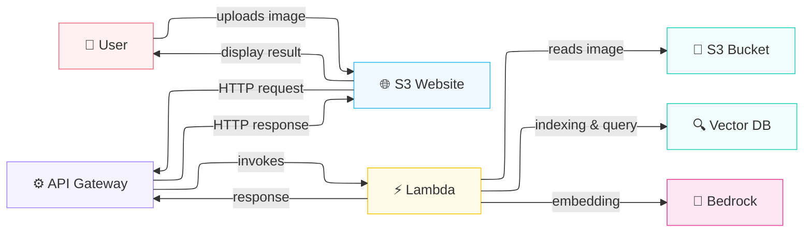

# S3 Vectors Image Search

⚠️ **TEST/DEMO PROJECT** - This is a demonstration project for learning purposes. **Do not use in production without significant security and infrastructure improvements.**

A serverless image search application that uses vector embeddings to find similar images. Built with AWS services: S3 Vectors, Bedrock (Amazon Nova), Lambda, and API Gateway.

## Overview

This project demonstrates a complete image search system using AI embeddings:

1. **Upload** an image through a web interface
2. **Generate** embeddings using Amazon Nova's multimodal model
3. **Search** S3 Vectors to find similar images
4. **Display** results in real-time

Everything is fully serverless and infrastructure-as-code with Terraform.

## Architecture



### Components

- **Website** (`website/`) - Static HTML/CSS/JS frontend
- **Lambda** (`search_lambda/`) - Vector search and embedding generation
- **Lambda Layer** (`lambda_layer/`) - Python dependencies (boto3, pillow, numpy)
- **Terraform** (`terraform/`) - Infrastructure as Code

## Technology Stack

- **Frontend**: HTML5, CSS3, Vanilla JavaScript
- **Backend**: AWS Lambda (Python 3.11)
- **Embeddings**: Amazon Bedrock - Nova Multimodal Embeddings v1
- **Vector DB**: AWS S3 Vectors
- **API**: AWS API Gateway (HTTP)
- **Storage**: Amazon S3
- **Networking**: VPC with private Lambda, VPC endpoints
- **IaC**: Terraform

## Prerequisites

### Required

- AWS Account with access to:
  - S3 Vectors (preview)
  - Bedrock (Nova model access)
  - Lambda, API Gateway, VPC
- Terraform >= 1.0
- AWS CLI configured with credentials

### Optional (for local development)

- Python 3.11+
- Docker (for building Lambda layer)

## Project Structure

```
s3-vectors-tests/
├── website/                 # Frontend application
│   ├── index.html          # Main HTML (template)
│   ├── app.js              # JavaScript logic
│   ├── style.css           # Styling
│   └── README.md           # Website documentation
│
├── search_lambda/          # Lambda function
│   ├── handler.py          # Main Lambda handler
│   └── test_event.json     # Test event
│
├── lambda_layer/           # Python dependencies
│   ├── requirements.txt    # Python packages
│   ├── Dockerfile          # Build image
│   ├── Makefile            # Build commands
│   └── README.md           # Layer documentation
│
├── terraform/              # Infrastructure as Code
│   ├── api.tf              # API Gateway & website S3
│   ├── lambdas.tf          # Lambda function & IAM
│   ├── network.tf          # VPC, subnets, endpoints
│   ├── storage.tf          # S3 buckets & S3 Vectors
│   ├── variables.tf        # Input variables
│   ├── providers.tf        # Provider configuration
│   └── data.tf             # Data sources
│
└── README.md               # This file
```

## Getting Started

### 1. Prerequisites Check

Verify Bedrock access:
```bash
aws bedrock-runtime list-foundation-models \
  --region us-east-1 \
  | grep nova
```

### 2. Deploy with Terraform

```bash
cd terraform

# Initialize Terraform
terraform init

# Review the plan
terraform plan

# Deploy everything
terraform apply
```

This will create:
- ✅ HTTP API Gateway with `/search` endpoint
- ✅ Lambda function in private VPC
- ✅ S3 buckets (images, website, deployments)
- ✅ S3 Vectors index for embeddings
- ✅ VPC endpoints for S3 and Bedrock
- ✅ IAM roles and policies
- ✅ Website with auto-injected configuration

### 3. Get Your Endpoint

After `terraform apply`, outputs show:

```
api_gateway_endpoint = "https://xxxxx.execute-api.region.amazonaws.com"
s3_bucket = "s3-vector-test-image-uploads"
s3_region = "us-east-1"
website_url = "http://s3-vector-test-website.s3-website-us-east-1.amazonaws.com"
```

Your website is live at the `website_url` output (note: HTTP only for test).

**CORS Security**: CORS is restricted to the S3 website endpoint only. For production with HTTPS, use CloudFront or a custom domain.

### 4. Test the API

```bash
# Upload an image to the S3 bucket
aws s3 cp /path/to/image.jpg \
  s3://s3-vector-test-image-uploads/test.jpg

# Call the API
curl -X POST https://xxxxx.execute-api.region.amazonaws.com/search \
  -H "Content-Type: application/json" \
  -d '{"bucket": "s3-vector-test-image-uploads", "key": "test.jpg"}'
```

## How It Works

### Flow

1. **Image Upload**: User selects image via web UI
2. **Storage**: Image is sent to S3 bucket
3. **Embedding**: Lambda generates embedding using Bedrock Nova
4. **Indexing**: Embedding stored in S3 Vectors
5. **Search**: Lambda queries S3 Vectors for K nearest neighbors
6. **Results**: Similar images returned to frontend

### Lambda Handler

The Lambda function (`search_lambda/handler.py`):
1. Receives S3 bucket and image key
2. Downloads image from S3
3. Encodes as base64
4. Calls Bedrock Nova for embedding (256-dim float32)
5. Stores in S3 Vectors index
6. Searches for 5 nearest neighbors
7. Returns results with distance scores

### Configuration Injection

Terraform automatically:
1. Renders `website/index.html` with template variables
2. Injects API endpoint, S3 bucket, region
3. Uploads rendered HTML to S3 website bucket

No manual configuration needed—everything is automated.

## Development

### Local Testing

Serve website locally:
```bash
cd website
python -m http.server 8000
# Or: npx http-server
```

Visit `http://localhost:8000`

**Note**: Local version won't have API configured. To test:
1. Deploy to AWS first with `terraform apply`
2. Or manually set in browser console:
   ```javascript
   window.API_GATEWAY_URL = 'https://your-endpoint.execute-api.region.amazonaws.com'
   window.S3_BUCKET = 's3-vector-test-image-uploads'
   window.S3_REGION = 'us-east-1'
   ```

### Lambda Development

Update `search_lambda/handler.py`, then redeploy:

```bash
cd terraform
terraform apply
```

Terraform will automatically zip and redeploy the function.

### Building Lambda Layer

Update dependencies in `lambda_layer/requirements.txt`:

```bash
cd lambda_layer
make all
cd ../terraform
terraform apply
```

### Testing Lambda Locally

```bash
cd search_lambda
cat test_event.json | python -c "
import json
import sys
from handler import lambda_handler

event = json.load(sys.stdin)
result = lambda_handler(event, None)
print(json.dumps(result, indent=2))
"
```

## API Specification

### Request

```
POST /search
Content-Type: application/json

{
  "bucket": "s3-vector-test-image-uploads",
  "key": "path/to/image.jpg"
}
```

### Response (Success)

```json
{
  "statusCode": 200,
  "body": {
    "nearest_neighbors": [
      {
        "key": "similar-image-1.jpg",
        "distance": 0.1234,
        "metadata": {
          "bucket": "s3-vector-test-image-uploads",
          "key": "similar-image-1.jpg"
        }
      }
    ]
  }
}
```

### Response (Error)

```json
{
  "statusCode": 400,
  "body": {
    "error": "bucket and key required"
  }
}
```

## AWS Resources Created

### Compute
- Lambda function: `vector-search-service`
- Lambda layer: `lambda_deps`

### API & Networking
- HTTP API Gateway: `vector-search-api`
- VPC with private/public subnets
- Security groups for Lambda and Bedrock endpoint
- VPC endpoints for S3 and Bedrock

### Storage
- S3 bucket: `s3-vector-test-website` (website)
- S3 bucket: `s3-vector-test-image-uploads` (images)
- S3 bucket: `s3-vector-test-lambda-deployments-bucket` (artifacts)
- S3 Vectors index: `cat-index` (256-dim cosine)
- S3 Vector bucket: `s3-vector-test-vector-store`

### IAM
- Lambda execution role with permissions for:
  - S3 read/write (images)
  - S3 Vectors query/insert
  - Bedrock Nova invocation
  - CloudWatch Logs

## Cost Considerations

### Key Cost Drivers

- **Bedrock**: Per inference charges for Nova embeddings
- **S3**: Storage for images and vectors
- **Lambda**: Execution time and memory
- **API Gateway**: Request count
- **Data Transfer**: Out of AWS

### Cost Optimization Tips

- Delete unused images from S3
- Archive old embeddings
- Monitor Lambda execution time
- Use S3 Intelligent-Tiering for archival

## ⚠️ Production Readiness

This is a **test/demo project**. The following issues must be addressed before production use:

### Critical Issues
- ❌ **No API authentication** - Anyone can invoke your API and incur costs
- ⚠️ **CORS restricted to S3 HTTP endpoint** - Fine for test, but HTTP only. For production with HTTPS, use CloudFront or custom domain
- ❌ **No rate limiting** - HTTP API throttling not supported; use WAF or REST API
- ❌ **Website publicly accessible** - Consider CloudFront with authentication

### Recommended Production Changes
1. **Add API Authentication**
   - Use AWS Cognito for user management
   - Or use Lambda Authorizer for custom auth
   - Or use IAM for internal-only access

2. **Implement CloudFront** 
   - Cache static content
   - Add WAF for rate limiting
   - Force HTTPS

3. **Enable Logging & Monitoring**
   - CloudWatch logs with alerts
   - API Gateway access logs
   - Lambda error tracking

4. **Add Cost Controls**
   - Set up billing alerts
   - Use AWS Budget notifications
   - Monitor Lambda execution time

5. **Security Improvements**
   - Enable VPC Flow Logs
   - Use AWS Secrets Manager for API keys
   - Implement request signing
   - Add input validation/sanitization

## Security

### What's Secure

- ✅ Lambda in private VPC (no public IP)
- ✅ VPC endpoints for AWS service access (no internet)
- ✅ Security groups restrict traffic (principle of least privilege)
- ✅ IAM policies follow least privilege
- ✅ S3 buckets encrypted at rest
- ✅ XSS vulnerability fixed (DOM-safe rendering)
- ✅ Proper error logging (no sensitive data exposure)

### Known Limitations (Test Project)

- ⚠️ API Gateway allows anonymous access
- ⚠️ CORS allows all origins
- ⚠️ No request throttling (HTTP API limitation)
- ⚠️ Website S3 bucket is publicly readable
- ⚠️ No user authentication
- ⚠️ Minimal input validation

## Troubleshooting

### Lambda can't reach Bedrock

- Check: VPC endpoint for Bedrock is created
- Check: Lambda security group allows egress to 443
- Check: Bedrock model access is enabled in your account

### Images not being indexed

- Check: S3 bucket has correct permissions
- Check: Lambda execution role has S3 Vectors permissions
- Check: Image format is supported (JPG, PNG)

### API returning 500 errors

- Check CloudWatch logs:
  ```bash
  aws logs tail /aws/lambda/vector-search-service --follow
  ```

## Cleanup

Remove all AWS resources:

```bash
cd terraform
terraform destroy
```

⚠️ This will delete all data, including indexed vectors and images.

## Next Steps

1. **Authentication**: Add Cognito for user auth
2. **Batch Processing**: Upload multiple images at once
3. **Similarity Threshold**: Filter results by distance score
4. **Image Gallery**: Show indexed images with preview
5. **Analytics**: Track searches and popular results
6. **Multi-Region**: Deploy in multiple AWS regions

## References

- [S3 Vectors Documentation](https://docs.aws.amazon.com/s3/)
- [Bedrock Nova Models](https://docs.aws.amazon.com/bedrock/)
- [Lambda VPC Configuration](https://docs.aws.amazon.com/lambda/latest/dg/configuration-vpc.html)
- [Terraform AWS Provider](https://registry.terraform.io/providers/hashicorp/aws/latest)

## License

MIT

## Support

For issues or questions:
1. Check CloudWatch logs: `aws logs tail /aws/lambda/vector-search-service --follow`
2. Review Terraform outputs: `cd terraform && terraform output`
3. Test manually with curl examples above
